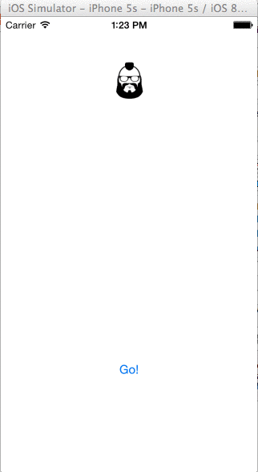

##Week 3 Part 1 Animation


>Note: CG Means ""Core Graphics"

####STEP 1. Add image to Images.xcassets
####STEP 2. Create image and button on storyboard.
####STEP 3. Create IBOutlets of the image and button in ViewController.Swift
####STEP 4. Create function 
```
    func chargeHead() {
    	// 
        headImage.frame.origin.y += 300
        headImage.transform = CGAffineTransformMakeScale(2, 2)
    }
```

```
    @IBAction func onGoButtton(sender: AnyObject) {
        UIView.animateWithDuration(0.3, animations: {() -> Void in self.self.chargeHead()
            //now let it grow as dropping down - need scale
            }) {(finished: Bool) -> Void in
                var angle = 10 * M_PI / 180
                self.headImage.transform = CGAffineTransformMakeRotation(angle)
        }
```  

Error will occur around

```
  self.headImage.transform = CGAffineTransformMakeRotation(angle)
```

**Fix:** The angle needs to be wrapped in a CGFloat  

```
var angle = CGFloat(10 * M_PI / 180)
```

However it charges, but it doesn't keep the scale.  

Here's the fix: CGAffineTransformRotate allows for the transform param and angle.

```
                self.headImage.transform = CGAffineTransformRotate(self.headImage.transform, angle)
```

Now let's nest our animations.   
1. Animation happens - charge
2. And when finished, do another animation, do a tilt.

Here's an example:

```  
    @IBAction func onGoButtton(sender: AnyObject) {
        //start animation by using the charching function
        UIView.animateWithDuration(0.3, animations: {() -> Void in self.self.chargeHead()
            //now let it grow as dropping down - need scale
            }) //when finished, tilt/ or bob
            {(finished: Bool) -> Void in
                UIView.animateWithDuration(0.2, animations: {() -> Void in
                var angle = CGFloat(10 * M_PI / 180)
                self.headImage.transform = CGAffineTransformRotate(self.headImage.transform, angle)
                }, completion: nil)
        }
```

Now... to give it a smooth motion, we need to autoreverse the motion and not have it start at the beginning.

```  
import UIKit

class ViewController: UIViewController {

    @IBOutlet weak var headImage: UIImageView!

    @IBOutlet weak var goButon: UIButton!
    
    override func viewDidLoad() {
        super.viewDidLoad()
        // Do any additional setup after loading the view, typically from a nib.
    }

    override func didReceiveMemoryWarning() {
        super.didReceiveMemoryWarning()
        // Dispose of any resources that can be recreated.
    }
    
    //Couldn't in obj-C, but you can assign parts with Swift
    //blocks means code in parenthesis
    
    func chargeHead() {
        headImage.frame.origin.y += 300
        headImage.transform = CGAffineTransformMakeScale(2, 2)
    }

    @IBAction func onGoButtton(sender: AnyObject) {
        //start animation by using the charching function
        UIView.animateWithDuration(0.3, animations: {() -> Void in self.self.chargeHead()
            //now let it grow as dropping down - need scale
            }) //when finished, tilt/ or bob
            {(finished: Bool) -> Void in
                //start with it tilted back
                var angle = CGFloat(-10 * M_PI / 180)
                self.headImage.transform = CGAffineTransformRotate(self.headImage.transform, angle)
                //then rotate foward and transform with tilt and autoreverse
                
                UIView.animateWithDuration(0.4, delay: 0,
                    options:UIViewAnimationOptions.Repeat |
                    //This reverse the animation to the starting point for a smooth motion.
                    UIViewAnimationOptions.Autoreverse, animations: { () -> Void in
                    var angle = CGFloat(30 * M_PI / 180)
                    self.headImage.transform = CGAffineTransformRotate(self.headImage.transform, angle)
                    }, completion: nil)
                
        }
        
    }
}
```
