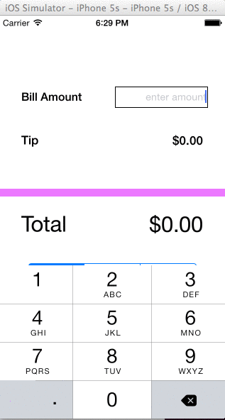

##Following CodePath's Swift Version

###Step One:  
Create your assets in Main.Storyboard

###Step Two:
Link your classes/outlet with ctrl +  drag to classes.  Drag from ```Main.StoryBoard```  to ```ViewController.Swift```

**Tip Calc**  
1. tipLabel (It's a UI Label You created)  
2. totalLabel (It's a UI Label you created)   
3. billField (It's a text field)  

```
class ViewController: UIViewController {
// put all your outlets in here
// create the names for all of the classes you want to work with
    
    @IBOutlet weak var billField: UITextField!
    @IBOutlet weak var tipLabel: UILabel!
    @IBOutlet weak var totalLabel: UILabel!
    
//...
```


>Note: If you have an error because of two conflicting Outlets. ""Class if not key-value coding compliant.""
Click on ([]) for View Controller and (->) on top of the right panel.

###Step Three
Load your label classes in the viewDidLoad method in the file ViewController.Swift

```
    override func viewDidLoad() {
        super.viewDidLoad()
                //initialize tip label
        	    //note: this will make the tip calculator start with 0.00
        
        tipLabel.text = "$0.00"
        totalLabel.text = "$0.00"
        
        }
 ```
 
 ###Step Four
 Make sure your keyboard popup is not alphanumeric, but decimal. 
 
 Go to Main.Storyboard and make sure TextField selected and the change ```Keyboard Type``` to "Decimal Pad" in the center menu.
 
### Step Five 
 Action ties into an event.
 Like IBOulet, link the textfield to the bottom of ViewController.swift

```
//...
    override func didReceiveMemoryWarning() {
        super.didReceiveMemoryWarning()
        // Dispose of any resources that can be recreated.
    }
	//After you link the action to the event... 
	//select EditingChanged for updates to happen while you type in textfield
	
    @IBAction func onEditingChanged(sender: AnyObject) {
        println("User editing bill")
    }

}

``` 

with ```println()``` it make sure to check if you're logging your actions. kind of like JS's NSLog

Now let's get rid of println() and create our calculator with the hardcoded tip value  

```
    @IBAction func onEditingChanged(sender: AnyObject) {
        // store whatever billamount in this variable
        //billField.text is a string but we want to change to decimal or float. Note that the NSString is used to convert Strings to Decimals -- this is a newer version that bridgeToObjC that was used in CodePath's video
        var billAmount = NSString(string: billField.text).doubleValue
        
        var tip = billAmount * 0.2
        var total = billAmount + tip
        
        tipLabel.text = "$\(tip)"
        totalLabel.text = "$\(total)"
    }
    
```


Let's format the amount to have 2 decimal places.  

```
    @IBAction func onEditingChanged(sender: AnyObject) {
        // store whatever billamount in this variable
        //billField.text is a string but we want to change to decimal or float
        var billAmount = NSString(string: billField.text).doubleValue
        
        var tip = billAmount * 0.2
        var total = billAmount + tip
        
        tipLabel.text = "$\(tip)"
        totalLabel.text = "$\(total)"
        
        //let's use formatting to specify how many decimal places it needs to move
        
        tipLabel.text = String(format: "$%.2f",tip)
        totalLabel.text = String(format: "$%.2f",tip)
    }
```


###Step Six: Tap anywhwere on the phone to get rid of keyboard
Gesture Recognizers (there are 7)  
We will be using "Tap". Drag it onto the view or any part that you want to be active and the new button will show up on the storyboard menu. 

Create an IBAction at the end of the ViewController.swift.  
Again, make sure after you drag and drop the gesture to the end of the file, to select "Action" and name it onTap.   
Within it, ```view.endEditing(true)``` dismisses the keyboard.

```
    @IBAction func onTap(sender: AnyObject) {
        //with the Gesture, the tapping should dismiss the keyboard
        view.endEditing(true)
    }
```

###Step Seven:
Now let's create the variables for tip percentages and soft code the bill:  
Create the variable for the array of tip percentages
Create a variable that links tipPercentages to tipControl(a UISecgmented index)
Go to Storyboard, then right click the segmented class, and select "Value Changed" and drag it to to the function IBAction onEditingChange in ViewController.Swift

```
class ViewController: UIViewController {
// put all your outlets in here
// create the names for all of the classes you want to work with
    
    @IBOutlet weak var billField: UITextField!
    @IBOutlet weak var tipLabel: UILabel!
    @IBOutlet weak var totalLabel: UILabel!
    @IBOutlet weak var tipControl: UISegmentedControl! //newguy
 ```
 
 Create the array for tipPercentages
 ```
 var tipPercentages = [0.18, 0.20, 0.22]
 ```
 
 Create a variable to link your array to the  to the UISegment 
 
```  
var tipPercentage = tipPercentages[tipControl.selectedSegmentIndex]

```
 
 new IBAction should look like this:
 
 ```
     @IBAction func onEditingChanged(sender: AnyObject) {
        
        //variable for tipPercentages and throw them into an array
        var tipPercentages = [0.18, 0.20, 0.22]
        var tipPercentage = tipPercentages[tipControl.selectedSegmentIndex]
      
        // store whatever billamount in this variable
        
        //billField.text is a string but we want to change to decimal or float
        
        var billAmount = NSString(string: billField.text).doubleValue

        var tip = billAmount * tipPercentage
        var total = billAmount + tip

        
        //let's use formatting to specify how many decimal places it needs to move
        
        tipLabel.text = String(format: "$%.2f",tip)
        totalLabel.text = String(format: "$%.2f",total)
        }
 ```
 
 Rightclick on UISegmentedControl from your Storyboard and drag the "Value Changed" to the onEditingChange funciton.
 
 Done.
